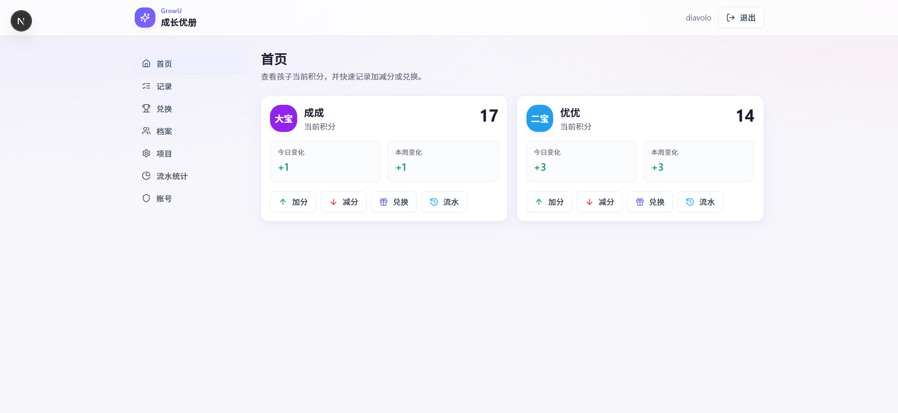
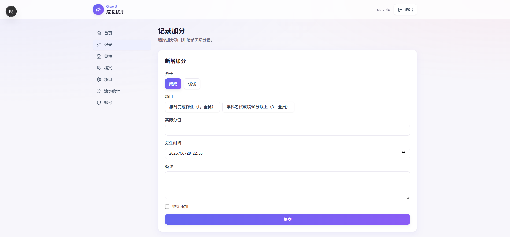
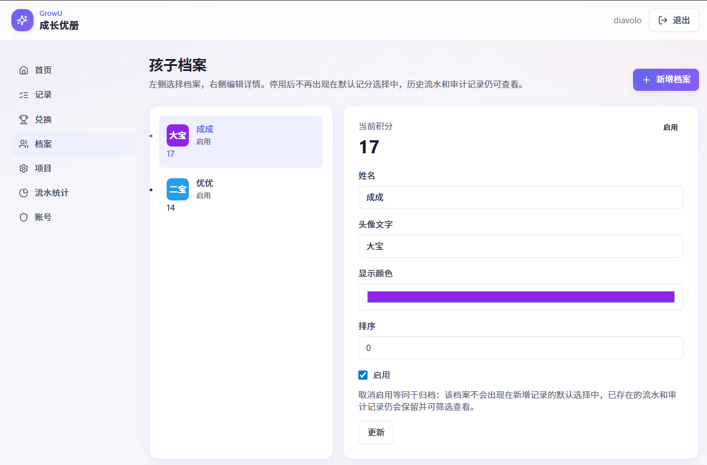
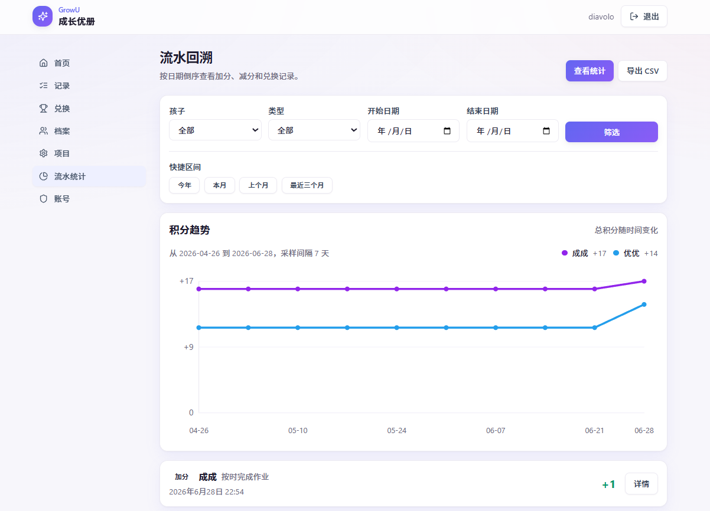
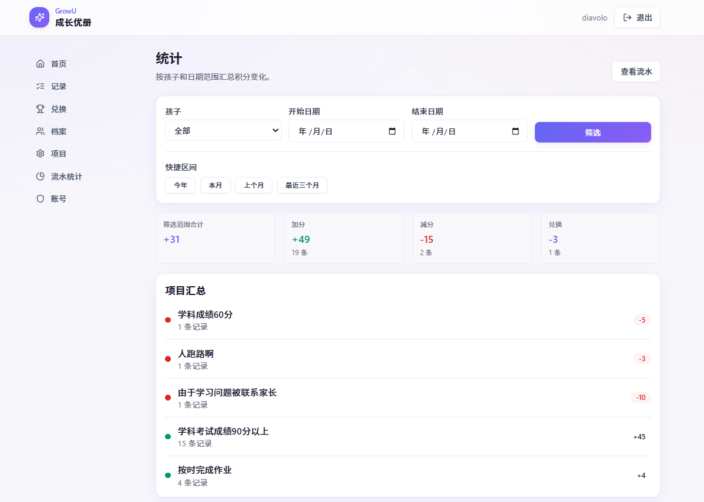

# GrowU

> [English](README.md) | [简体中文](README.zh-CN.md)

GrowU is a simple positive-reinforcement progress and points tracker for children. Parents or guardians can manage children, define point items, record bonus or penalty events, redeem rewards, review transaction history, and export CSV reports without losing historical data.

## Features

- Database-backed user accounts with roles and account management
- First-run admin creation at `/setup`
- Login flow at `/login`
- Child profiles with disable-only lifecycle to preserve history
- Bonus, penalty, and reward item management with disable-only lifecycle
- Transaction history with `itemNameSnapshot` preservation
- Reward redemption balance checks
- Transaction edit history through `TransactionRevision`
- CSV export for transaction data, including readable Chinese content when exported

## Screenshots

<table>
  <tr>
    <td width="50%" align="center"><br><sub>Login — gradient background with glass card</sub></td>
    <td width="50%" align="center"><br><sub>Dashboard — balances and quick actions</sub></td>
  </tr>
  <tr>
    <td width="50%" align="center"><br><sub>Record bonus — tag-based picker</sub></td>
    <td width="50%" align="center"><br><sub>Profiles — master-detail management</sub></td>
  </tr>
  <tr>
    <td width="50%" align="center"><br><sub>Transactions — trend chart and history</sub></td>
    <td width="50%" align="center"><br><sub>Statistics — aggregated summaries</sub></td>
  </tr>
</table>

## Stack

- Next.js App Router
- TypeScript
- Tailwind CSS
- Prisma
- PostgreSQL

## Docker Quick Start

1. Copy the environment template:

```bash
cp .env.example .env
```

2. Edit `.env` and set these required values:

- `POSTGRES_PASSWORD`
- `DATABASE_URL`
- `AUTH_SECRET`
- `AUTH_COOKIE_SECURE`

Use an explicit `DATABASE_URL`. If the database password contains reserved URI characters such as `@`, `:`, `/`, `?`, or `#`, URL-encode the password before placing it in the connection string.

3. Start the stack:

```bash
docker compose up --build
```

4. Open the app and finish first-run setup:

- Visit `http://localhost:3000/setup`
- Create the initial admin account
- Sign in at `http://localhost:3000/login`

Detailed Docker guidance: [docs/docker-deployment.md](docs/docker-deployment.md)

## Non-Docker Development and Deployment

Install dependencies:

```bash
npm install
```

Set `DATABASE_URL` and `AUTH_SECRET` in `.env`, then apply migrations:

```bash
npm run prisma:deploy
```

Run the development server:

```bash
npm run dev
```

Or build and run production mode:

```bash
npm run build
npm run start
```

On a new database, visit `/setup` first to create the initial admin account.

## Documentation

- [docs/docker-deployment.md](docs/docker-deployment.md)
- [docs/cloud-deployment.md](docs/cloud-deployment.md)
- [docs/upgrading.md](docs/upgrading.md)
- [docs/local-dev-setup.md](docs/local-dev-setup.md)
- [docs/developer-guide.md](docs/developer-guide.md)
- [docs/growu-v1-plan.md](docs/growu-v1-plan.md)

## Account Notes

- GrowU now uses database-backed `UserAccount` records.
- The first account is created through `/setup` when no account exists yet.
- Admin account management is available at `/settings/accounts`.
- Keep at least one enabled admin account at all times.
- Legacy environment-defined accounts are only for upgrade import through `GROWU_ACCOUNTS` and `npm run migrate:legacy-accounts`.
